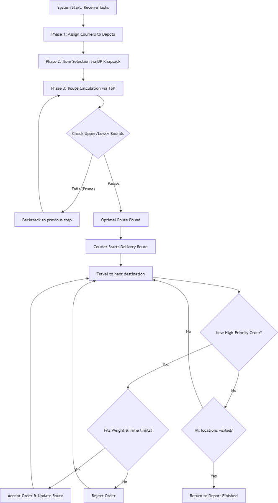

# Integrated Logistics & Value-Optimization Problem

> **An advanced algorithmic approach to autonomous delivery system routing, combining static optimization with real-time dynamic event handling.**

This repository contains the solution architecture for a Complex Computing Problem (CCP) developed for the **Design and Analysis of Algorithms (CS-272)** course at the **University of Engineering and Technology (UET) Lahore**.

## Project Overview
The objective of this project is to design the logic for an autonomous delivery system serving a high-value electronics hub. The system must select the most valuable packages to deliver while strictly respecting the physical weight capacities and time/distance budgets of multiple couriers. 

Because this problem deeply conflicts—maximizing abstract financial profit while minimizing physical travel expenditures—it is fundamentally **NP-Hard**. Our solution bridges classical computational theory with applied algorithmic design to make this intractable problem solvable and adaptable to real-time changes.

## Core Modules & System Architecture

### 1. Complexity Analysis & Problem Reductions
We mathematically reduced the integrated problem into three classical optimization problems based on constraint variations:
*   **Traveling Salesperson Problem (TSP):** When capacity is infinite and priorities are uniform.
*   **0/1 Knapsack Problem:** When routing costs are ignored, focusing solely on capacity vs. value.
*   **Generalized Assignment Problem (GAP):** When items are binned into multiple couriers without spatial routing.
*   **Intractability:** The exhaustive solution space is proven to be $\mathcal{O}((2K)^N \times N!)$, necessitating advanced pruning techniques.

### 2. Exact Solver via Branch & Bound
To guarantee optimal solutions for medium-scale inputs without evaluating trillions of useless permutations, we built a rigorous state-space tree pruner:
*   **Upper Bound (Value):** Utilizes a **Fractional Knapsack Greedy Approach** to calculate the absolute maximum potential profit of remaining items.
*   **Lower Bound (Cost):** Implements a **Minimum Spanning Tree (MST)** approximation to guarantee a mathematical minimum for remaining routing distances.

### 3. Heuristic Selection (Dynamic Programming)
To rapidly resolve the courier capacity constraints in isolation, we map the selection phase to a 2D Dynamic Programming tabular sub-solver.
*   **Time Complexity:** $\mathcal{O}(N \cdot Q_k)$
*   Evaluates the inclusion vs. exclusion of items using overlapping subproblems to maximize priority value before spatial routing begins.

### 4. Dynamic Logistics Extension
Real-world delivery systems face unpredictable events. We extended the static architecture with a rapid, event-driven decision rule to handle mid-route interruptions (e.g., a new high-priority package appears).
*   **Real-Time Heuristic:** Implements a **Cheapest Insertion Detour** check combined with weight capacity and time budget filters. 
*   Allows the system to accept/reject new orders or interrupt active routes in milliseconds without running a full TSP recalculation.

## System Execution Flow
*(Upload your system execution flowchart to the repository and replace `diagram.png` with the actual file name)*

## Team Members
This project was collaboratively designed and documented by:
*   **Noor Fatima** 
*   [**Muhammad Ayan Sajid**](https://github.com/MuhammadAyanSajid)
*   **Syed Ayan Akbar**
*   [**Muhammad Husnain** ](https://github.com/nexhus)

## Academic Details
*   **Institution:** University of Engineering and Technology (UET) Lahore, New Campus
*   **Department:** Department of Computer Science
*   **Course:** Design and Analysis of Algorithms
*   **Instructor:** [Ms. Darakhshan Bokhat](https://www.linkedin.com/in/drakhshanbokhat/)
*   **Term:** Spring 2026

---
*Note: This repository is intended for academic demonstration and portfolio purposes. The algorithms discussed are theoretical models and logic frameworks for advanced logistical systems.*
